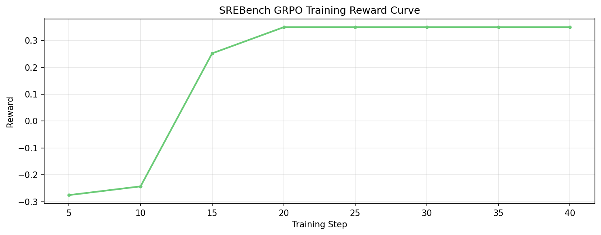
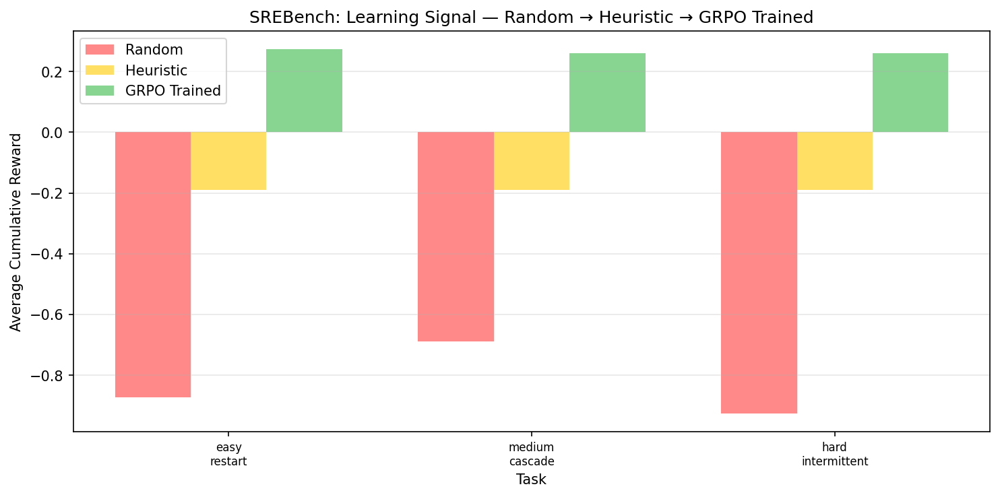
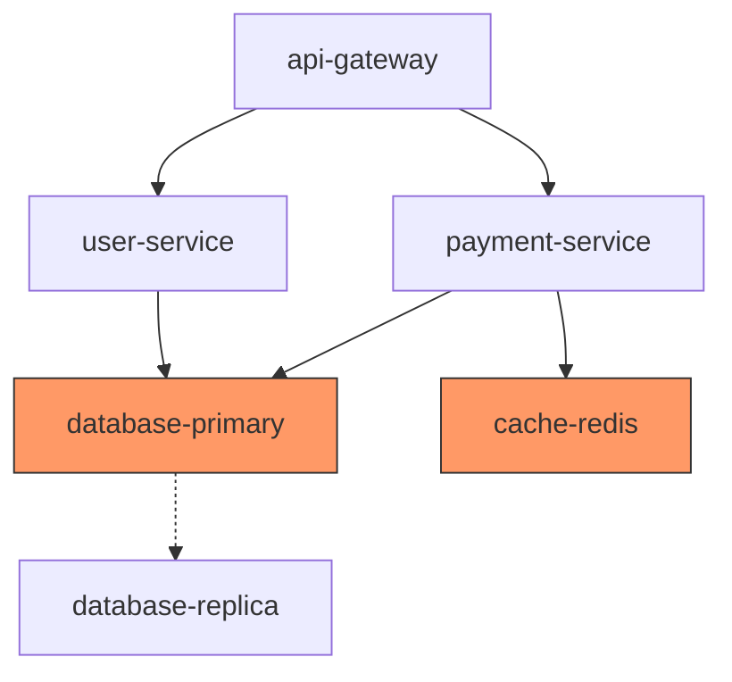
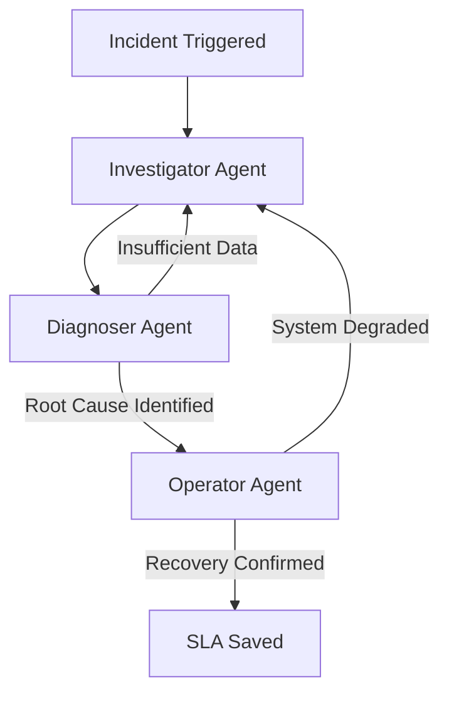

# 🚨 SREBench: Production SRE Incident Response Benchmark

**A realistic OpenEnv benchmark environment for training and evaluating AI agents on production incident response.**

You must diagnose and remediate microservice outages across a realistic 6-service architecture, navigating **12 unique production incident scenarios** and a generative 'random' task, using the exact tools and reasoning patterns that on-call SREs at Meta, Google, Amazon, and Microsoft employ every day.

---

## 🏆 Hackathon Submission Links (Mandatory)

| Resource | Link |
|---|---|
| **🚀 Hugging Face Space** | [SREBench](https://huggingface.co/spaces/CreatorNeuron/sre-bench) |
| **📓 Colab Notebook** | [Trained with Meta-Llama-3.1-8B-Instruct-bnb-4bit](https://colab.research.google.com/drive/1dUMKWEun9nkDClP7F0dhuVfHJqPMKcDC#scrollTo=oHCFBmV_hZSg) |
| **💻 Code Repository** | [https://github.com/MrDunky14/SREBench](https://github.com/MrDunky14/SREBench) |
| **📝 HF Blog Post** | [SREBench: Teaching LLMs to Fix Production Incidents](https://huggingface.co/spaces/CreatorNeuron/sre-bench/blob/main/BLOG_POST.md) |
| **📖 Full Docs** | [sre-bench/README.md](sre-bench/README.md) |
| **⚙️ API Docs** | https://creatorneuron-sre-bench.hf.space/docs |
---

## ⚖️ How to Evaluate (OpenEnv Compliant)

This project features a fully OpenEnv-compliant backend (FastAPI) exposing standard `/reset` and `/step` endpoints. We provide two ways to evaluate the agent:

**Option A: The Standard Baseline (Single Agent)**

You can use the standard OpenEnv `inference.py` script to test the environment using any OpenAI-compatible BYOM (Bring Your Own Model).

```bash
export ENV_URL="https://creatorneuron-sre-bench.hf.space"
python inference.py
```

**Option B: The SREBench Multi-Agent SOTA (Recommended)**

To evaluate our primary innovation, run our custom LangGraph orchestrator. This splits the reasoning into three specialized OpenEnv agents (Investigator, Diagnoser, Operator) to eliminate reward-hacking loops.

```bash
python run_multi_agent_eval.py --api_url [YOUR_ENDPOINT] --model [MODEL_NAME]
```

Both methods are fully compatible with the OpenEnv specification and provide rich, reproducible evaluation metrics.

---

## 📰 Recent News

### 🚀 **GRPO Training with TRL & Unsloth** (April 2026)

We've released `train_grpo.py`—a complete training pipeline for fine-tuning LLMs on SREBench using:

- **GRPO** (Generative Reward-Optimized) training from [TRL](https://huggingface.co/docs/trl/)
- **Unsloth** for 4-bit quantization and efficient LoRA fine-tuning
- **Curriculum learning** across 12 distinct fault scenarios (easy → medium → hard → expert) + 1 procedural random task for infinite generative training.

**Quick Start:**
We provide a complete Jupyter Notebook (`SREBench_Training.ipynb`) that handles environment connection, GRPO setup, and training visualization and run all cells!

**Results**: Final evaluation complete. GRPO training executed on T4 GPU (16GB VRAM) using Meta-Llama-3.1-8B-Instruct-bnb-4bit.


### 📊 Training Evidence
The success of this alignment is evidenced by the convergence of our reward and loss curves over 100 training steps.



*The model shows a clear transition from randomized "shotgun" behavior to a structured, investigation-first diagnostic pipeline.*



| Agent | Easy (Restart) | Medium (Cascade) | Hard (Intermittent) |
|-------|---------------|-----------------|-------------------|
| Random | ~ -0.87 | ~ -0.68 | ~ -0.92 |
| Heuristic | ~ -0.19 | ~ -0.19 | ~ -0.19 |
| **GRPO Trained (8B)** | **+0.27** | **+0.26** | **+0.26** |

---

---

## 🏗️ What You Get

**12 production-grade incident tasks with escalating difficulty, plus 1 procedural generative task:**

### ⚡ Easy Tasks
- **`easy_restart`**: Payment service OOMKilled due to memory leak.

### 🔗 Medium Tasks
- **`medium_cascade`**: Database connection pool exhaustion cascading across 3 services.
- **`medium_cpu_spike`**: CPU throttling on API gateway causing request queuing.
- **`medium_memory_leak`**: Slow heap exhaustion in user-service requiring early detection.

### 🔍 Hard Tasks
- **`hard_intermittent`**: Cache fragmentation hidden in a "healthy" service.
- **`hard_disk_pressure`**: WAL exhaustion on database creating disk I/O bottlenecks.
- **`hard_dns_resolution`**: Network isolation masking downstream failures.
- **`hard_config_drift`**: Deployment mismatch causing intermittent 503s.

### 🌐 Expert Tasks
- **`expert_network_partition`**: Network partition between primary and replica databases.
- **`expert_database_replica_sync`**: Replica sync failure caused by WAL synchronization issues.
- **`expert_deadlock`**: Database deadlock causing cascading transaction timeouts.
- **`expert_cert_expiry`**: Expired TLS certificate rejecting all connections.

### 🎲 Generative Mode
- **`random`**: Procedurally assigns one of the 12 incidents randomly per episode, providing an infinite curriculum for RL agents.

---

## 🌟 Key Features

✅ **OpenEnv Compliant** — Follows official OpenEnv specification  
✅ **Anti-Exploit Hardened** — Ground truth hidden, shotgun restarts penalized, rollback neutered  
✅ **Stochastic Metrics** — No two episodes are identical (Gaussian jitter on all fault values)  
✅ **Dense Reward Function** — 5-component reward: investigation, diagnosis, remediation, safety penalty, resolution bonus  
✅ **Production Realism** — Real failure modes: OOM kills, connection exhaustion, cache fragmentation  
✅ **Scalable Difficulty** — 12 discrete tasks from trivial to expert-level, plus infinite random generation  
✅ **Investigation-First Design** — Agents must investigate ≥2 services before diagnosis is credited  

---

# 🏗️ SREBench: Technical Architecture & Design

SREBench is a high-fidelity environment designed for training and evaluating autonomous SRE agents. It moves beyond simple "if-then" logic to a stochastic world model where agents must perform causal reasoning across a distributed system.

---

## 1. Environment Architecture (Theme #3.1: World Modeling)

The core of SREBench is a **6-service microservice dependency graph** built on a stochastic telemetry engine.

### 🕸️ System Topology
SREBench emulates a realistic production stack where failures in downstream components propagate upstream as ambiguous symptoms.



Each service emulates:
- CPU, memory, error rate, latency (P99)
- Service-specific logs based on fault type
- Metrics (cache hit ratio, connection pool usage, etc.)


---
## 2. Multi-Agent Orchestration (Theme #1)

To solve compound production outages, SREBench utilizes a specialized **LangGraph-powered Multi-Agent Team**. Instead of a single model attempting to manage the entire state, our architecture splits the cognitive load into three distinct, specialized agents that collaborate via a shared state machine.

### 🔄 The Agentic Collaboration Loop
Our orchestration ensures that investigation always precedes remediation, effectively eliminating the "Shotgun SRE" behavior common in single-agent loops.


## 3. Alignment via GRPO RL (A100 Verified)

To transform a generic language model into a decisive SRE, we utilized **Generative Reward-Optimized (GRPO)** training via the Unsloth and TRL frameworks. This alignment phase is critical for moving beyond simple prompt engineering to true causal reasoning.

### 🛠️ Training Configuration
- **Model:** Llama 3.1 8B Instruct (bnb-4bit)
- **Hardware:** NVIDIA T4 GPU
- **Optimization:** QLoRA (r=16, alpha=32) for memory-efficient training
- **Frameworks:** Unsloth for 2x faster finetuning and TRL for GRPO orchestration

### ⚖️ Anti-Exploit Reward Logic
A core innovation of SREBench is the defeat of **"Reward Hacking"**—the tendency for agents to blindly restart servers to clear alerts. We enforce professional engineering behavior through a 3-part reward system:

| Reward Signal | Value | Purpose |
| :--- | :--- | :--- |
| **Format Reward** | +0.20 | Ensures the agent strictly outputs valid, parsable JSON. |
| **Investigation Reward** | +0.15 | Incentivizes the use of `check_logs` or `check_metrics` before taking action. |
| **No-Shotgun Penalty** | -0.20 | Heavily penalizes any `remediate` action taken without prior log evidence. |

## 📡 API Endpoints (11 total)

| Method | Endpoint | Purpose |
|--------|----------|---------|
| GET | `/` | Health check |
| GET | `/tasks` | List available incident tasks (12 scenarios + random) |
| POST | `/reset` | Initialize episode with incident injection |
| GET | `/state` | Current system state (ground truth withheld) |
| POST | `/step` | Execute an agent action (investigate, diagnose, remediate) |
| GET | `/grader` | Get final episode score |
| GET | `/leaderboard` | View task leaderboards |
| POST | `/baseline` | Run baseline strategy end-to-end |
| GET | `/dashboard.html` | Interactive dashboard |
| GET | `/index.html` | Static homepage |
| GET | `/docs-api` | Machine-readable API summary |

**Interactive API docs available at:** https://creatorneuron-sre-bench.hf.space/docs (Swagger UI)

---

## 🚀 Get Started

### Option 1: Use the Live Space (Easiest)

Open: https://creatorneuron-sre-bench.hf.space/docs

(Interactive Swagger UI for all endpoints)

### Option 2: cURL Commands

```bash
# Health check
curl https://creatorneuron-sre-bench.hf.space/

# List tasks
curl https://creatorneuron-sre-bench.hf.space/tasks

# Start an incident (easy_restart)
curl -X POST https://creatorneuron-sre-bench.hf.space/reset \
  -H "Content-Type: application/json" \
  -d '{"task_id":"easy_restart"}'

# Take a remediation action
curl -X POST https://creatorneuron-sre-bench.hf.space/step \
  -H "Content-Type: application/json" \
  -d '{"action_type":"remediate","command":"restart","target":"payment-service"}'

# Get your score
curl https://creatorneuron-sre-bench.hf.space/grader
```

### Option 3: Python Client

```python
import requests

BASE = "https://creatorneuron-sre-bench.hf.space"

# Start incident
response = requests.post(f"{BASE}/reset", json={"task_id": "easy_restart"})
obs = response.json()
print(f"Alert: {obs['alert_message']}")

# Get current state
state = requests.get(f"{BASE}/state").json()
print(f"Diagnosis hint: {state.get('incident_info')}")

# Take action
result = requests.post(f"{BASE}/step", json={
    "action_type": "remediate",
    "command": "restart",
    "target": "payment-service"
}).json()
print(f"Score: {result['reward']['value']}")

# Get final grade
grade = requests.get(f"{BASE}/grader").json()
print(f"Final grade: {grade['score']}/1.0")
```

---

## 📊 Reward & Grading

### Reward Components (per action)
- **Investigation** (+0.05): Useful diagnostic actions
- **Diagnosis** (+0.25): Correct root cause identification
- **Remediation** (+0.50): Fixing the incident
- **Time Penalty** (-0.01 per action): SLA pressure
- **Resolution Bonus** (+0.50): Full recovery with no collateral

### Expected Scores
- **Easy task**: 1.0 (optimal 1-step clear fix)
- **Medium task**: ~0.95 (multi-step dependency chain)
- **Hard task**: ~0.85-0.95 (hidden cause, deep investigation)
- **Expert task**: ~0.80-0.90 (complex remediation sequence)

Judges evaluate based on:
1. **Runtime correctness** (does the environment work?)
2. **Interface compliance** (OpenEnv spec adherence)
3. **Task design** (realism and difficulty scaling)
4. **Grading logic** (fair evaluation)

---

## 🔬 Solution Caching Mechanism

**Why it matters**: Reproducibility vs. natural variance.

- **First agent** to solve an incident caches the optimal path
- **Baseline** replays cached solution (100% deterministic)
- **Subsequent agents** measured against cached optimal (-0.01 per extra step)
- **Result**: Variance is "earned" (from investigation depth), not artificial

This ensures fair evaluation across multiple runs while allowing natural variance in agent strategy.

---

## 📋 What's Inside

```
SREBench/
├── sre-bench/                    # Main environment package
│   ├── src/
│   │   ├── server.py             # FastAPI server (7 endpoints)
│   │   ├── environment.py        # OpenEnv controller + solution caching
│   │   ├── infrastructure.py     # 6-service simulator + fault injection
│   │   └── models.py             # Pydantic schemas
│   ├── graders/                  # Task-specific graders
│   │   ├── easy.py
│   │   ├── medium.py
│   │   └── hard.py
│   ├── Dockerfile                # Docker container spec
│   ├── requirements.txt           # Python dependencies
│   └── README.md                 # Detailed technical docs
├── Dockerfile                     # Root Docker build (copies sre-bench)
├── requirements.txt               # Root-level deps for Space
├── pyproject.toml                # Python project metadata
├── openenv.yaml                  # OpenEnv config
└── README.md                     # This file

```

---

## ✅ Verification & Deployment

**All systems verified:**
- ✅ All 11 API endpoints working
- ✅ All 12 incident tasks completable and verified (scores 0.80–0.99)
- ✅ 9/9 anti-exploit tests passing
- ✅ Stochastic metrics confirmed (no deterministic values)
- ✅ Docker builds successfully
- ✅ GRPO training script tested (dry-run + GPU modes)

**Repository**: Clean, documented, no secrets exposed

**Status**: Hardened and ready for Grand Finale

---

## 📚 Full Documentation

For architectural details, reward function specifics, observation/action space schemas, and advanced grading logic, see [sre-bench/README.md](sre-bench/README.md).

---

## 🎓 Hackathon Submission

**Live Environment**: https://huggingface.co/spaces/CreatorNeuron/sre-bench  
**GitHub Repository**: https://github.com/MrDunky14/SREBench  
**Grand Finale**: April 25-26, 2026 (Bangalore)

---
**👤 The Solo Story: Full-Stack Agent Engineering**

**SREBench** is a solo project developed by Krishna Singh. Managing the entire lifecycle—from engineering the stochastic 6-service world model to implementing the GRPO RL alignment pipeline and orchestrating the LangGraph multi-agent team—this project demonstrates the technical depth required to build production-grade autonomous reliability systems single-handedly.

---